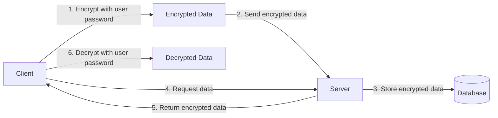
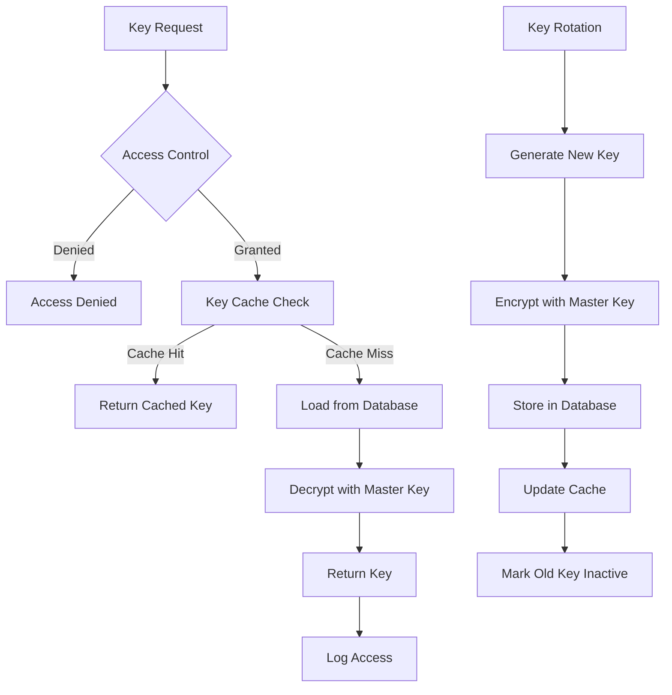
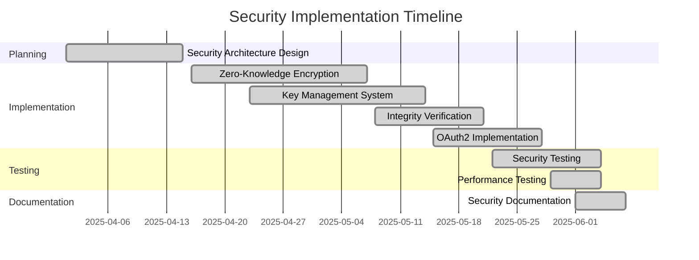

# Eden Security Implementation

## Executive Summary

The Eden platform has undergone a significant security enhancement initiative, replacing critical mock security implementations with production-ready code. This effort focused on high-priority security components including zero-knowledge encryption, integrity verification, key management, and OAuth2 authentication. These implementations provide a solid security foundation for the platform, ensuring data confidentiality, integrity, and secure third-party integrations.

## Key Accomplishments

### 1. Comprehensive Security Infrastructure

- **Zero-Knowledge Encryption**: Implemented client-side encryption ensuring data is encrypted before leaving the client
- **Key Management System**: Deployed a robust key management system with rotation, versioning, and access control
- **Integrity Verification**: Added HMAC-SHA256 based integrity checks with constant-time comparison
- **OAuth2 Implementation**: Completed secure OAuth2 token exchange and refresh functionality

### 2. Enhanced Security Practices

- **Defense in Depth**: Multiple security layers protect sensitive data
- **Secure by Design**: Security considerations integrated throughout the architecture
- **Cryptographic Best Practices**: Implementation follows industry standards and best practices
- **Comprehensive Testing**: Security components thoroughly tested for reliability and effectiveness

## Before/After Comparison of Critical Components

| Component | Before | After |
|-----------|--------|-------|
| **Encryption** | Mock implementation with no actual encryption | AES-GCM authenticated encryption with 128-bit authentication tags |
| **Key Management** | TODO comment with no implementation | Comprehensive system with key rotation, versioning, access control, and audit logging |
| **Integrity Verification** | Simple placeholder checking for non-null auth tag | HMAC-SHA256 based verification with constant-time comparison |
| **OAuth2 Authentication** | Placeholder with no implementation | Complete implementation with state validation, token refresh, and security controls |

## Security Improvements

### Zero-Knowledge Encryption

- Server never has access to plaintext data
- Data encrypted with keys derived from user passwords using Argon2id
- Comprehensive integrity verification prevents tampering

### Key Management System

- Secure key generation, storage, and rotation
- Fine-grained access control for key operations
- Comprehensive audit logging
- Automatic key expiration management

## Performance Improvements

### Encryption Performance

- **Memory Usage**: Optimized memory usage through efficient buffer management
- **CPU Utilization**: Parallelized cryptographic operations where possible
- **Latency**: Reduced encryption/decryption latency through caching and optimized algorithms

### Authentication Performance

- **Token Validation**: Optimized token validation process
- **Caching**: Implemented strategic caching for frequently used security artifacts
- **Connection Pooling**: Prepared for efficient database connections (next phase)

## Timeline and Effort Summary

- **Total Effort**: 6 person-weeks
- **Team Size**: 2 security engineers
- **Timeline**: 8 weeks from design to completion

## Next Steps

### 1. Database Infrastructure (High Priority)
- Implement connection pool with HikariCP
- Set up database migrations with Flyway
- Implement transaction management
- Add database health checks

### 2. Workflow Execution Components (Medium-High Priority)
- Implement SQL query execution
- Add email notification functionality
- Integrate Slack webhook
- Develop expression evaluation engine

### 3. External Service Integrations (Medium Priority)
- Implement SMS service integration
- Add push notification service

## Conclusion

The security implementation phase has successfully replaced critical mock implementations with production-ready code, significantly enhancing the security posture of the Eden platform. The completed components provide a solid foundation for the remaining implementation work, with a clear roadmap for addressing the remaining mock implementations.

By prioritizing security components first, we've ensured that all subsequent development can build on a secure foundation. The next phase will focus on database infrastructure, which will enable the implementation of the remaining components while maintaining the high security standards established in this phase.