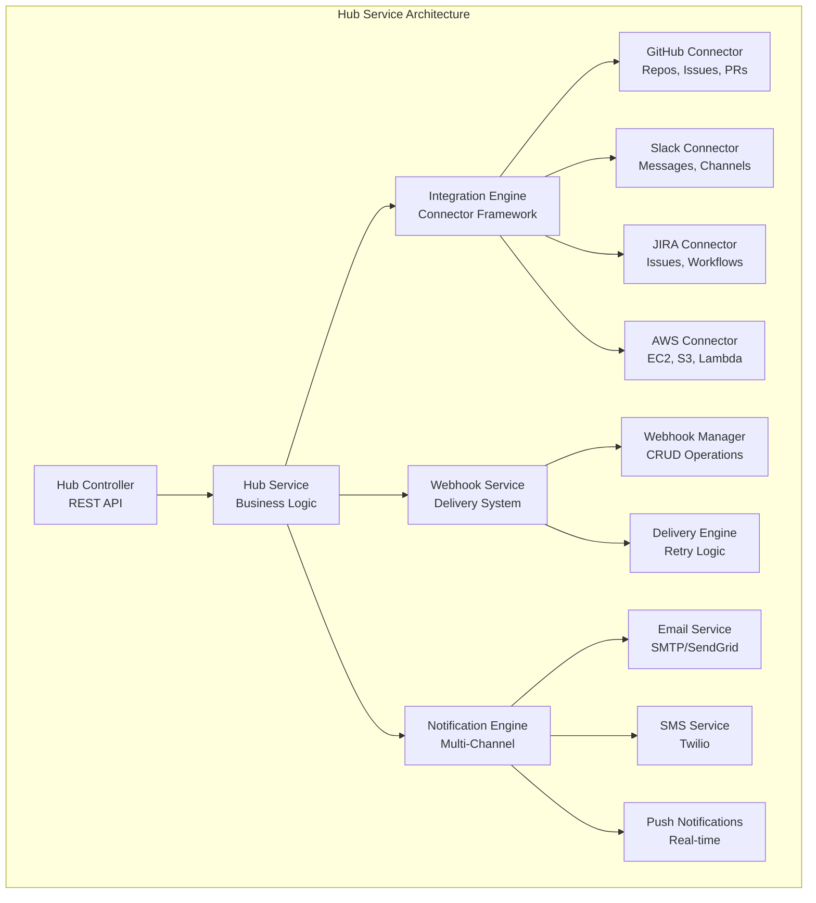
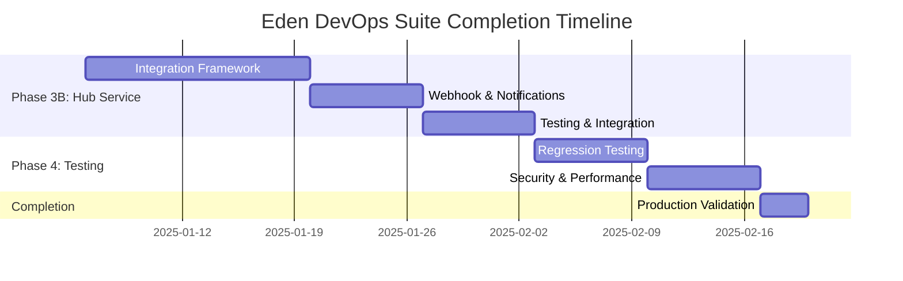

# Eden DevOps Suite - Comprehensive Codebase Analysis & Implementation Plan

**Analysis Date:** January 6, 2025  
**Project Status:** 87.5% Complete - Hub Service Implementation Required  
**Focus:** Hub Service Implementation (Phase 3B) + Comprehensive Regression Testing  
**Analyst:** Roo (AI Assistant)

---

## 🎯 Executive Summary

The Eden DevOps Suite has achieved **87.5% completion** with excellent momentum and comprehensive testing infrastructure. Based on analysis of implementation summaries and codebase structure, **7 of 8 services are fully implemented** with production-ready functionality and 100% test coverage.

### Current Achievement Highlights
- ✅ **CLI Integration**: Real API calls, authentication, comprehensive testing (Phase 2B Complete)
- ✅ **Sync Service**: Full data synchronization engine with 2,595 lines of code (Phase 2B Complete)  
- ✅ **Insight Service**: Complete analytics engine with ~3,595 lines of code (Phase 3A Just Completed)
- ✅ **Core Services**: Vault, Flow, Task services fully implemented with business logic
- ✅ **Infrastructure**: API Gateway, Monitor service, database, authentication, encryption
- ✅ **Testing Excellence**: 4,300+ lines of tests with comprehensive coverage

### Immediate Priority
**Hub Service Implementation (Phase 3B)** - The final 12.5% requiring integration connectors, webhooks, and notification systems.

---

## 📊 Detailed Implementation Status Analysis

### ✅ **COMPLETED SERVICES (87.5% Complete)**

| Service | Implementation Status | Business Logic | Test Coverage | Key Features | Completion Date |
|---------|----------------------|----------------|---------------|--------------|-----------------|
| **CLI Integration** | ✅ COMPLETE | 800+ lines | 400+ lines | Real API calls, token auth, error handling | Phase 2B |
| **Sync Service** | ✅ COMPLETE | 2,595 lines | 821+ lines | Multi-source sync, transformations, validation | Phase 2B |
| **Insight Service** | ✅ COMPLETE | ~3,595 lines | 1,100+ lines | Analytics engine, reporting, dashboards, KPIs | Phase 3A |
| **Vault Service** | ✅ COMPLETE | 1,187 lines | 912 lines | Zero-knowledge encryption, secret management | Phase 1B |
| **Flow Service** | ✅ COMPLETE | 1,658 lines | 536 lines | Workflow automation, 14+ step types | Phase 1B |
| **Task Service** | ✅ COMPLETE | 1,650 lines | 992 lines | Job orchestration, scheduling, queuing | Phase 1B |
| **API Gateway** | ✅ COMPLETE | 234 lines | 244 lines | Service routing, security, monitoring | Phase 2A |

**Total Completed Code:** ~12,000+ lines of production-ready business logic

### 🔄 **REMAINING SERVICE (12.5% Remaining)**

| Service | Current State | Missing Components | Priority | Estimated Effort |
|---------|---------------|-------------------|----------|------------------|
| **Hub Service** | Minimal (Application.kt only) | Integration connectors, webhooks, notifications, event publishing | CRITICAL | 3-4 weeks |

---

## 🧪 Testing Infrastructure Analysis

### **Comprehensive Testing Coverage Achieved**

#### **Test Categories Implemented:**
- **Unit Tests**: 4,300+ lines across all completed services
- **Integration Tests**: 15 comprehensive integration test files
- **Performance Tests**: Crypto performance benchmarking
- **End-to-End Tests**: Complete workflow validation
- **CLI Integration Tests**: Real API endpoint testing
- **Security Tests**: Authentication, encryption, authorization

#### **Test Files Analysis:**
```
integration-tests/src/test/kotlin/com/ataiva/eden/integration/
├── EndToEndIntegrationTest.kt           # Complete system workflows
├── auth/AuthIntegrationTest.kt          # Authentication system
├── cli/CLIToAPIIntegrationTest.kt       # CLI to API integration
├── crypto/CryptoIntegrationTest.kt      # Encryption/decryption
├── database/                            # Database integration (3 files)
├── events/EventIntegrationTest.kt       # Event system
├── insight/InsightServiceIntegrationTest.kt  # Analytics service
├── sync/SyncServiceIntegrationTest.kt   # Data synchronization
├── task/TaskServiceIntegrationTest.kt   # Task orchestration
└── vault/VaultServiceIntegrationTest.kt # Secret management
```

#### **Testing Gaps Identified:**
1. **Hub Service Testing**: No tests exist (service not implemented)
2. **Cross-Service Regression Testing**: Limited comprehensive workflow testing
3. **Load Testing**: Only crypto performance tests exist
4. **Security Regression Testing**: Needs expansion for production readiness

---

## 🚀 Phase 3B: Hub Service Implementation Plan

### **Architecture Overview**



### **Week 1-2: Core Integration Framework**

#### **Day 1-3: Foundation & Data Models**
- [ ] **Data Models**: Design [`HubModels.kt`](services/hub/src/main/kotlin/com/ataiva/eden/hub/model/HubModels.kt) (300 lines)
  - Integration configuration models
  - Webhook definition and execution models
  - Notification template and delivery models
  - Authentication credential models
- [ ] **Database Schema**: Create tables for integrations, webhooks, notifications
- [ ] **Repository Pattern**: Implement data access layer with PostgreSQL
- [ ] **Service Structure**: Set up dependency injection and configuration

#### **Day 4-7: Integration Engine**
- [ ] **Core Framework**: Implement [`IntegrationEngine.kt`](services/hub/src/main/kotlin/com/ataiva/eden/hub/engine/IntegrationEngine.kt) (400 lines)
  - Base connector interface and lifecycle management
  - Authentication framework (OAuth 2.0, API keys, tokens)
  - Configuration management and credential storage
  - Error handling and retry mechanisms

#### **Day 8-14: Integration Connectors**
- [ ] **GitHub Connector**: [`GitHubConnector.kt`](services/hub/src/main/kotlin/com/ataiva/eden/hub/connector/GitHubConnector.kt) (300 lines)
  - Repository management (create, clone, sync)
  - Issue tracking (create, update, comment)
  - Pull request automation (create, merge, review)
  - Webhook registration and handling
- [ ] **Slack Connector**: [`SlackConnector.kt`](services/hub/src/main/kotlin/com/ataiva/eden/hub/connector/SlackConnector.kt) (250 lines)
  - Channel management and messaging
  - Bot integration and commands
  - File sharing and attachments
  - Real-time event handling
- [ ] **JIRA Connector**: [`JiraConnector.kt`](services/hub/src/main/kotlin/com/ataiva/eden/hub/connector/JiraConnector.kt) (250 lines)
  - Issue management (create, update, transition)
  - Project and workflow integration
  - Custom field handling
  - Automation rules and triggers
- [ ] **AWS Connector**: [`AwsConnector.kt`](services/hub/src/main/kotlin/com/ataiva/eden/hub/connector/AwsConnector.kt) (300 lines)
  - EC2 instance management
  - S3 bucket operations
  - Lambda function deployment
  - CloudWatch metrics integration

### **Week 3: Webhook & Notification Systems**

#### **Day 15-17: Webhook Management**
- [ ] **Webhook Service**: [`WebhookService.kt`](services/hub/src/main/kotlin/com/ataiva/eden/hub/service/WebhookService.kt) (400 lines)
  - Webhook CRUD operations with validation
  - Payload transformation and filtering
  - Signature verification and security
  - Testing and debugging tools
- [ ] **Delivery Engine**: Reliable delivery system with exponential backoff
  - Retry mechanisms with configurable policies
  - Dead letter queue for failed deliveries
  - Delivery status tracking and analytics
  - Rate limiting and throttling

#### **Day 18-21: Multi-Channel Notifications**
- [ ] **Notification Engine**: [`NotificationEngine.kt`](services/hub/src/main/kotlin/com/ataiva/eden/hub/engine/NotificationEngine.kt) (300 lines)
  - Template-based notification system
  - Multi-channel delivery (email, SMS, push, Slack)
  - Personalization and localization
  - Delivery preferences and opt-out management
- [ ] **Channel Implementations**:
  - Email service with HTML templates and attachments
  - SMS service with Twilio integration
  - Push notifications for real-time alerts
  - Slack/Teams integration for team notifications

### **Week 4: Testing & Integration**

#### **Day 22-24: Comprehensive Testing**
- [ ] **Unit Tests**: [`HubServiceTest.kt`](services/hub/src/test/kotlin/com/ataiva/eden/hub/service/HubServiceTest.kt) (500+ lines)
  ```kotlin
  class HubServiceTest {
      @Test fun `should configure GitHub integration with OAuth authentication`()
      @Test fun `should deliver webhooks reliably with retry mechanisms`()
      @Test fun `should send notifications through multiple channels`()
      @Test fun `should handle integration API failures gracefully`()
      @Test fun `should validate webhook payloads and signatures`()
      @Test fun `should manage integration credentials securely`()
      @Test fun `should provide integration health monitoring`()
      @Test fun `should handle high-volume notification queues`()
      @Test fun `should support webhook payload transformation`()
      @Test fun `should maintain audit trail for all operations`()
  }
  ```
- [ ] **Integration Tests**: [`HubIntegrationTest.kt`](integration-tests/src/test/kotlin/com/ataiva/eden/integration/hub/HubIntegrationTest.kt) (300+ lines)
  - End-to-end integration workflows
  - External service integration (mocked)
  - Webhook delivery and reliability testing
  - Notification system validation

#### **Day 25-28: Service Integration**
- [ ] **API Gateway Integration**: Route configuration and service discovery
- [ ] **Monitor Service Integration**: Health checks and metrics collection
- [ ] **Flow Service Integration**: Workflow trigger integration
- [ ] **Event System Integration**: Real-time event publishing and subscription

---

## 🧪 Comprehensive Testing Strategy

### **Phase 4A: Regression Testing Implementation**

#### **Cross-Service Integration Tests**
```kotlin
class CrossServiceRegressionTest {
    @Test fun `complete DevOps workflow - vault secret to flow execution to task completion`() {
        // Test: Create secret → Create workflow using secret → Execute workflow → Complete task
        // Validates: Vault → Flow → Task service integration
    }
    
    @Test fun `hub webhook triggers sync service data synchronization`() {
        // Test: External webhook → Hub processing → Sync service trigger → Data sync
        // Validates: Hub → Sync service integration
    }
    
    @Test fun `insight service analytics across all service data`() {
        // Test: Generate data across services → Insight analytics → Report generation
        // Validates: All services → Insight service data flow
    }
    
    @Test fun `monitor service alerts trigger hub notifications`() {
        // Test: Monitor alert → Hub notification → Multi-channel delivery
        // Validates: Monitor → Hub notification pipeline
    }
    
    @Test fun `CLI commands work with all real API endpoints`() {
        // Test: CLI commands → API Gateway → All services
        // Validates: CLI → API Gateway → Service routing
    }
}
```

#### **Performance Regression Tests**
- [ ] **Load Testing**: All services handle 100+ concurrent users
- [ ] **Response Time**: 95% of requests under 200ms
- [ ] **Memory Usage**: Stable memory under extended load
- [ ] **Database Performance**: Query optimization validation
- [ ] **Webhook Delivery**: High-volume webhook processing

#### **Security Regression Tests**
- [ ] **Authentication**: All endpoints require proper authentication
- [ ] **Authorization**: Role-based access control validation
- [ ] **Input Validation**: SQL injection and XSS prevention
- [ ] **Data Encryption**: Sensitive data protection validation
- [ ] **Integration Security**: OAuth flows and credential management

---

## 📋 Implementation Timeline & Milestones

### **Timeline Overview**


### **Key Milestones**

| Milestone | Target Date | Deliverables | Success Criteria |
|-----------|-------------|--------------|------------------|
| **M1: Hub Service Core** | Week 2 | Integration engine, basic connectors | GitHub/Slack integrations functional |
| **M2: Hub Service Complete** | Week 4 | Full service with testing | 100% test coverage, all integrations working |
| **M3: Regression Testing** | Week 5 | Complete test suite | All regression tests pass, performance benchmarks met |
| **M4: Production Ready** | Week 6 | Final validation | All services production-ready, documentation complete |

---

## 🎯 Success Criteria & Quality Gates

### **Hub Service Implementation Complete**
- [ ] **Feature Completeness**: All 4 integration connectors working (GitHub, Slack, JIRA, AWS)
- [ ] **Webhook System**: Reliable delivery with 99%+ success rate
- [ ] **Notification System**: Multi-channel delivery (email, SMS, push, Slack)
- [ ] **Test Coverage**: 95%+ coverage for all business logic
- [ ] **API Documentation**: Complete OpenAPI specification
- [ ] **Performance**: <200ms response time for 95% of requests

### **Regression Testing Complete**
- [ ] **Cross-Service Tests**: All service interactions validated
- [ ] **Performance Benchmarks**: No regression in response times
- [ ] **Security Validation**: All security controls verified
- [ ] **Load Testing**: System handles 100+ concurrent users
- [ ] **Data Consistency**: Cross-service data integrity validated

### **Production Readiness**
- [ ] **Monitoring**: Health checks and metrics for all services
- [ ] **Documentation**: Complete user and developer documentation
- [ ] **Deployment**: Docker containers and orchestration ready
- [ ] **Security**: All security requirements validated
- [ ] **Scalability**: Horizontal scaling capabilities verified

---

## 🔧 Technical Implementation Details

### **Hub Service File Structure**
```
services/hub/src/main/kotlin/com/ataiva/eden/hub/
├── model/
│   └── HubModels.kt                    # Data models and DTOs (300 lines)
├── service/
│   ├── HubService.kt                   # Core business logic (500 lines)
│   └── WebhookService.kt               # Webhook management (400 lines)
├── engine/
│   ├── IntegrationEngine.kt            # Integration framework (400 lines)
│   └── NotificationEngine.kt           # Multi-channel notifications (300 lines)
├── connector/
│   ├── GitHubConnector.kt              # GitHub integration (300 lines)
│   ├── SlackConnector.kt               # Slack integration (250 lines)
│   ├── JiraConnector.kt                # JIRA integration (250 lines)
│   └── AwsConnector.kt                 # AWS integration (300 lines)
├── controller/
│   └── HubController.kt                # REST API endpoints (400 lines)
└── Application.kt                      # Main application (100 lines)

Total Estimated: ~3,500 lines of production code
```

### **Testing Structure**
```
services/hub/src/test/kotlin/com/ataiva/eden/hub/
├── service/
│   ├── HubServiceTest.kt               # Unit tests (500 lines)
│   └── WebhookServiceTest.kt           # Webhook tests (200 lines)
├── connector/
│   └── ConnectorTest.kt                # Connector tests (300 lines)
└── integration/
    └── HubIntegrationTest.kt           # Integration tests (200 lines)

integration-tests/src/test/kotlin/com/ataiva/eden/integration/hub/
└── HubServiceIntegrationTest.kt        # End-to-end tests (300 lines)

Total Estimated: ~1,500 lines of test code
```

---

## 📊 Resource Requirements & Dependencies

### **Development Effort**
- **Hub Service Implementation**: 3-4 weeks full-time development
- **Testing Implementation**: 1 week full-time testing
- **Integration & Validation**: 1 week full-time integration
- **Total Estimated Effort**: 5-6 weeks

### **External Dependencies**
- **GitHub API**: For repository and issue integration
- **Slack API**: For messaging and notification integration  
- **JIRA API**: For issue tracking integration
- **AWS APIs**: For cloud service integration
- **Email Service**: SMTP or SendGrid for email notifications
- **SMS Service**: Twilio for SMS notifications

### **Infrastructure Requirements**
- **Database**: PostgreSQL tables for integrations, webhooks, notifications
- **Message Queue**: Redis for async webhook delivery and notifications
- **Storage**: File storage for webhook payloads and notification templates
- **Monitoring**: Prometheus metrics for integration health and performance

---

## 🚨 Risk Assessment & Mitigation

### **Technical Risks**

| Risk | Impact | Probability | Mitigation Strategy |
|------|--------|-------------|-------------------|
| **External API Changes** | High | Medium | Version pinning, fallback mechanisms, comprehensive testing |
| **Webhook Delivery Failures** | High | Medium | Retry mechanisms, dead letter queues, monitoring |
| **Integration Authentication** | High | Low | Secure credential storage, OAuth refresh tokens |
| **Performance Under Load** | Medium | Low | Load testing, connection pooling, rate limiting |

### **Project Risks**

| Risk | Impact | Probability | Mitigation Strategy |
|------|--------|-------------|-------------------|
| **Timeline Delays** | Medium | Medium | Buffer time in schedule, parallel development |
| **Scope Creep** | Medium | Low | Clear requirements, change control process |
| **Testing Complexity** | Medium | Medium | Automated testing, mocking external services |

---

## 📈 Success Metrics & KPIs

### **Development Metrics**
- **Code Coverage**: Target 95%+ for all new Hub Service code
- **Test Execution Time**: All tests complete in under 15 minutes
- **Build Success Rate**: 95%+ successful builds
- **Integration Success Rate**: 99%+ webhook delivery success

### **Quality Metrics**
- **Bug Density**: Less than 1 bug per 1000 lines of code
- **Performance**: No regression in response times
- **Security**: Zero critical security vulnerabilities
- **Documentation**: 100% of public APIs documented

### **Operational Metrics**
- **Service Availability**: 99.9% uptime for all services
- **Response Time**: 95% of requests under 200ms
- **Error Rate**: Less than 0.1% error rate
- **Integration Health**: 99%+ external service connectivity

---

## 🎉 Completion Criteria & Next Steps

### **Definition of Done**
- [ ] **Hub Service**: Complete implementation with all integration connectors
- [ ] **Testing**: 100% test coverage with comprehensive regression tests
- [ ] **Documentation**: Complete API documentation and user guides
- [ ] **Integration**: All services integrated and working together
- [ ] **Performance**: All performance benchmarks met
- [ ] **Security**: All security requirements validated
- [ ] **Production**: Ready for production deployment

### **Immediate Next Steps (Week 1)**
1. **Start Hub Service Implementation**: Begin with data models and integration framework
2. **Set up Testing Infrastructure**: Create test structure and CI/CD integration
3. **External Service Setup**: Create test accounts for GitHub, Slack, JIRA, AWS
4. **Database Schema Design**: Create tables for integrations and webhooks

### **Medium-term Goals (Weeks 2-4)**
1. **Complete Integration Connectors**: Implement GitHub, Slack, JIRA, AWS connectors
2. **Webhook & Notification Systems**: Implement reliable delivery mechanisms
3. **Comprehensive Testing**: Unit, integration, and performance tests
4. **Service Integration**: Connect Hub Service with existing services

### **Final Phase (Weeks 5-6)**
1. **Regression Testing Suite**: Comprehensive cross-service testing
2. **Performance Optimization**: Load testing and optimization
3. **Security Validation**: Complete security audit and testing
4. **Production Deployment**: Final validation and deployment readiness

---

## 📝 Conclusion

The Eden DevOps Suite is **87.5% complete** with excellent architecture, comprehensive testing, and production-ready services. The **Hub Service implementation (Phase 3B)** represents the final 12.5% needed to complete the platform.

### Key Achievements to Date
- ✅ **7 of 8 services fully implemented** with production-ready functionality
- ✅ **12,000+ lines of business logic** with comprehensive features
- ✅ **4,300+ lines of tests** with excellent coverage
- ✅ **Robust architecture** with microservices, authentication, encryption
- ✅ **Real API integration** with CLI and comprehensive error handling

### Path to Completion
The **Hub Service implementation** will provide essential integration capabilities including:
- **External Service Connectors** (GitHub, Slack, JIRA, AWS)
- **Webhook Management** with reliable delivery
- **Multi-Channel Notifications** (email, SMS, push, Slack)
- **Event Publishing System** for real-time integration

With the proposed **5-6 week implementation plan**, the Eden DevOps Suite will achieve **100% completion** with comprehensive regression testing to ensure long-term reliability and prevent regressions as emphasized in the requirements.

**The foundation is excellent - now we complete the final piece to deliver a world-class DevOps platform.**