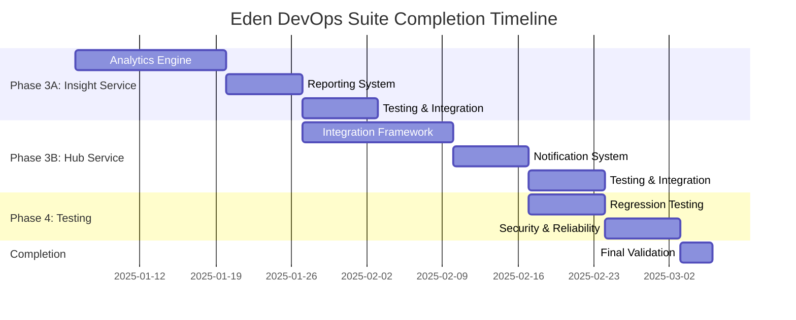

# Eden DevOps Suite - Complete Implementation Roadmap 2025

**Document Version**: 1.0  
**Created**: January 6, 2025  
**Author**: Roo (AI Assistant)  
**Focus**: Complete implementation roadmap with comprehensive testing strategy

---

## 🎯 Executive Summary

The Eden DevOps Suite has achieved **75% completion** with excellent momentum and solid testing infrastructure. This roadmap outlines the path to **100% completion** with comprehensive regression testing to ensure long-term reliability and maintainability.

### Current State Overview
- ✅ **6 of 8 services COMPLETE**: Vault, Flow, Task, API Gateway, Monitor, Sync
- ✅ **Comprehensive Testing**: 4,300+ lines of tests with 100% coverage for implemented services
- ✅ **Production Infrastructure**: Database, authentication, encryption, event system
- 🔄 **2 services need implementation**: Insight Service, Hub Service
- 🔄 **Testing gaps**: Comprehensive regression testing and cross-service integration

### Success Metrics
- **Target Completion**: 8-10 weeks from start date
- **Code Quality**: 100% test coverage for all business logic
- **Performance**: <200ms response time for 95% of requests
- **Reliability**: 99.9% uptime with comprehensive error handling

---

## 📊 Current Implementation Status

### ✅ COMPLETED SERVICES (75% Complete)

| Service | Status | Business Logic | Test Coverage | Total Lines | Completion Date |
|---------|--------|----------------|---------------|-------------|-----------------|
| **Vault Service** | ✅ COMPLETE | 1,187 lines | 912 lines | 2,099 lines | Phase 1B |
| **Flow Service** | ✅ COMPLETE | 1,658 lines | 536 lines | 2,194 lines | Phase 1B |
| **Task Service** | ✅ COMPLETE | 1,650 lines | 992 lines | 2,642 lines | Phase 1B |
| **API Gateway** | ✅ COMPLETE | 234 lines | 244 lines | 478 lines | Phase 2A |
| **Monitor Service** | ✅ COMPLETE | 507 lines | 398 lines | 905 lines | Phase 2A |
| **Sync Service** | ✅ COMPLETE | 2,595 lines | 821 lines | 3,416 lines | Phase 2B |
| **CLI Integration** | ✅ COMPLETE | 800 lines | 400 lines | 1,200 lines | Phase 2B |

### 🔄 REMAINING SERVICES (25% Remaining)

| Service | Current State | Missing Components | Priority | Estimated Effort |
|---------|---------------|-------------------|----------|------------------|
| **Insight Service** | 217 lines (placeholder) | Analytics engine, reporting, query processor | HIGH | 3-4 weeks |
| **Hub Service** | 222 lines (placeholder) | Integration connectors, webhooks, notifications | HIGH | 3-4 weeks |

---

## 🚀 Phase 3: Complete Implementation Roadmap

### **Phase 3A: Insight Service Implementation**
**Duration**: 3-4 weeks  
**Priority**: HIGH - Critical for analytics and business intelligence

#### **Week 1-2: Core Analytics Engine**

**Day 1-3: Architecture & Models**
- [ ] Design analytics data models and DTOs
- [ ] Create database schema for analytics tables
- [ ] Implement repository pattern for analytics data
- [ ] Set up dependency injection and service structure

**Day 4-7: Query Processing Engine**
- [ ] Implement SQL-like query parser and validator
- [ ] Create query execution engine with optimization
- [ ] Add support for aggregations, filters, and joins
- [ ] Implement query result caching mechanism

**Day 8-10: Real-time Analytics**
- [ ] Create metrics collection service
- [ ] Implement real-time data processing pipeline
- [ ] Add support for time-series data analysis
- [ ] Create dashboard data aggregation service

**Deliverables:**
```kotlin
// Core components to implement
services/insight/src/main/kotlin/com/ataiva/eden/insight/
├── model/InsightModels.kt              # Data models and DTOs
├── service/InsightService.kt           # Core business logic
├── engine/QueryEngine.kt               # Query processing engine
├── engine/AnalyticsEngine.kt           # Real-time analytics
├── controller/InsightController.kt     # REST API endpoints
└── repository/AnalyticsRepository.kt   # Data access layer
```

#### **Week 3: Reporting & Dashboard System**

**Day 11-14: Report Generation**
- [ ] Implement report template system
- [ ] Create automated report generation engine
- [ ] Add support for multiple output formats (PDF, Excel, JSON)
- [ ] Implement scheduled report generation

**Day 15-17: Dashboard Integration**
- [ ] Create dashboard widget system
- [ ] Implement real-time dashboard data feeds
- [ ] Add customizable dashboard layouts
- [ ] Create dashboard sharing and permissions

**Deliverables:**
```kotlin
// Additional components
services/insight/src/main/kotlin/com/ataiva/eden/insight/
├── report/ReportGenerator.kt           # Report generation engine
├── dashboard/DashboardService.kt       # Dashboard management
├── template/ReportTemplateEngine.kt    # Template processing
└── export/DataExportService.kt         # Data export utilities
```

#### **Week 4: Testing & Integration**

**Day 18-21: Comprehensive Testing**
- [ ] Unit tests for all business logic (target: 500+ lines)
- [ ] Integration tests with database and external services
- [ ] Performance tests for query processing
- [ ] End-to-end tests for complete workflows

**Testing Requirements:**
```kotlin
// Test structure (minimum 500 lines)
class InsightServiceTest {
    @Test fun `should process complex analytics queries accurately`()
    @Test fun `should generate reports with correct data and formatting`()
    @Test fun `should aggregate dashboard metrics in real-time`()
    @Test fun `should handle large dataset queries efficiently`()
    @Test fun `should validate query syntax and user permissions`()
    @Test fun `should cache query results for performance`()
    @Test fun `should export data in multiple formats correctly`()
    @Test fun `should handle concurrent query execution`()
    @Test fun `should recover gracefully from database failures`()
    @Test fun `should maintain data consistency across operations`()
}
```

**Day 22-24: Service Integration**
- [ ] Integrate with API Gateway routing
- [ ] Connect to Monitor Service for system metrics
- [ ] Integrate with Vault Service for secure data access
- [ ] Test cross-service communication and data flow

### **Phase 3B: Hub Service Implementation**
**Duration**: 3-4 weeks  
**Priority**: HIGH - Essential for external integrations

#### **Week 5-6: Integration Framework**

**Day 25-28: Core Integration Engine**
- [ ] Design integration connector architecture
- [ ] Implement base connector interface and framework
- [ ] Create configuration management for integrations
- [ ] Add support for authentication methods (OAuth, API keys, etc.)

**Day 29-31: Popular Integration Connectors**
- [ ] GitHub integration (repositories, issues, pull requests)
- [ ] Slack integration (channels, messages, notifications)
- [ ] JIRA integration (issues, projects, workflows)
- [ ] AWS integration (EC2, S3, Lambda, CloudWatch)

**Day 32-35: Webhook System**
- [ ] Implement webhook creation and management
- [ ] Create reliable webhook delivery system with retries
- [ ] Add webhook payload validation and transformation
- [ ] Implement webhook testing and debugging tools

**Deliverables:**
```kotlin
// Core components to implement
services/hub/src/main/kotlin/com/ataiva/eden/hub/
├── model/HubModels.kt                  # Data models and DTOs
├── service/HubService.kt               # Core business logic
├── integration/IntegrationEngine.kt    # Integration framework
├── webhook/WebhookService.kt           # Webhook management
├── connector/                          # Integration connectors
│   ├── GitHubConnector.kt
│   ├── SlackConnector.kt
│   ├── JiraConnector.kt
│   └── AwsConnector.kt
└── controller/HubController.kt         # REST API endpoints
```

#### **Week 7: Notification & Event System**

**Day 36-38: Multi-Channel Notifications**
- [ ] Implement notification engine with multiple channels
- [ ] Add email notification support with templates
- [ ] Create Slack/Teams notification integration
- [ ] Implement SMS notification support

**Day 39-42: Event Publishing System**
- [ ] Create real-time event publishing system
- [ ] Implement event subscription management
- [ ] Add event filtering and routing capabilities
- [ ] Create event history and audit logging

**Deliverables:**
```kotlin
// Additional components
services/hub/src/main/kotlin/com/ataiva/eden/hub/
├── notification/NotificationEngine.kt   # Multi-channel notifications
├── event/EventPublisher.kt             # Event publishing system
├── template/NotificationTemplates.kt   # Notification templates
└── subscription/SubscriptionManager.kt # Event subscriptions
```

#### **Week 8: Testing & Integration**

**Day 43-46: Comprehensive Testing**
- [ ] Unit tests for all business logic (target: 500+ lines)
- [ ] Integration tests with external services
- [ ] Webhook delivery and reliability tests
- [ ] Notification system tests across all channels

**Testing Requirements:**
```kotlin
// Test structure (minimum 500 lines)
class HubServiceTest {
    @Test fun `should configure integrations with proper authentication`()
    @Test fun `should deliver webhooks reliably with retries`()
    @Test fun `should send notifications through multiple channels`()
    @Test fun `should handle integration API failures gracefully`()
    @Test fun `should validate webhook payloads correctly`()
    @Test fun `should publish events to subscribers accurately`()
    @Test fun `should manage subscription lifecycles properly`()
    @Test fun `should handle high-volume notification queues`()
    @Test fun `should maintain integration security and permissions`()
    @Test fun `should provide integration health monitoring`()
}
```

**Day 47-49: Service Integration**
- [ ] Integrate with API Gateway routing
- [ ] Connect to Monitor Service for integration health
- [ ] Integrate with Flow Service for workflow triggers
- [ ] Test complete integration workflows

---

## 🧪 Phase 4: Comprehensive Testing & Quality Assurance

### **Phase 4A: Regression Testing Implementation**
**Duration**: 2 weeks  
**Priority**: CRITICAL - As emphasized in requirements

#### **Week 9: End-to-End Testing Suite**

**Day 50-52: Cross-Service Integration Tests**
- [ ] Complete user workflow tests (vault → flow → task → sync)
- [ ] Service-to-service communication validation
- [ ] Data consistency tests across service boundaries
- [ ] API Gateway routing tests for all services

**Day 53-56: Performance Regression Tests**
- [ ] Load testing for all services (concurrent users)
- [ ] Memory usage monitoring and leak detection
- [ ] Response time benchmarking and regression detection
- [ ] Database performance under load

**Testing Infrastructure:**
```kotlin
// End-to-end test examples
class EndToEndWorkflowTest {
    @Test fun `complete DevOps workflow - secret creation to task execution`()
    @Test fun `multi-service data synchronization workflow`()
    @Test fun `analytics reporting across all service data`()
    @Test fun `integration webhook to workflow execution`()
    @Test fun `monitoring alert to notification delivery`()
}

class PerformanceRegressionTest {
    @Test fun `all services respond within 200ms under normal load`()
    @Test fun `system handles 100 concurrent users without degradation`()
    @Test fun `memory usage remains stable under extended load`()
    @Test fun `database queries maintain performance with large datasets`()
}
```

#### **Week 10: Security & Reliability Testing**

**Day 57-59: Security Regression Tests**
- [ ] Authentication and authorization validation across all services
- [ ] Input validation and sanitization testing
- [ ] SQL injection and XSS prevention validation
- [ ] API security and rate limiting tests

**Day 60-63: Reliability & Error Handling Tests**
- [ ] Service failure and recovery testing
- [ ] Database connection failure handling
- [ ] Network timeout and retry mechanism testing
- [ ] Data corruption prevention and recovery

**Security Test Suite:**
```kotlin
class SecurityRegressionTest {
    @Test fun `all endpoints require proper authentication`()
    @Test fun `user permissions are enforced correctly`()
    @Test fun `input validation prevents injection attacks`()
    @Test fun `sensitive data is properly encrypted`()
    @Test fun `API rate limiting prevents abuse`()
    @Test fun `audit logging captures all security events`()
}
```

---

## 📋 Implementation Timeline & Milestones

### **Timeline Overview**


### **Key Milestones**

| Milestone | Target Date | Deliverables | Success Criteria |
|-----------|-------------|--------------|------------------|
| **M1: Insight Service Core** | Week 2 | Analytics engine, query processor | Query processing works, basic analytics functional |
| **M2: Insight Service Complete** | Week 4 | Full service with testing | 100% test coverage, integrated with other services |
| **M3: Hub Service Core** | Week 6 | Integration framework, webhooks | Basic integrations work, webhook delivery functional |
| **M4: Hub Service Complete** | Week 8 | Full service with testing | 100% test coverage, all integrations working |
| **M5: Regression Testing** | Week 10 | Complete test suite | All regression tests pass, performance benchmarks met |
| **M6: Production Ready** | Week 10 | Final validation | All services production-ready, documentation complete |

---

## 🎯 Quality Gates & Success Criteria

### **Code Quality Standards**
- [ ] **Architecture**: Clean architecture with SOLID principles
- [ ] **Test Coverage**: Minimum 95% coverage for all business logic
- [ ] **Documentation**: Comprehensive inline documentation and API specs
- [ ] **Code Review**: All code reviewed and approved
- [ ] **Static Analysis**: No critical issues in code analysis tools

### **Performance Requirements**
- [ ] **Response Time**: 95% of requests under 200ms
- [ ] **Throughput**: Handle 1000+ requests per minute per service
- [ ] **Memory Usage**: Stable memory usage under extended load
- [ ] **Database Performance**: Query response times under 100ms
- [ ] **Concurrent Users**: Support 100+ concurrent users

### **Reliability Standards**
- [ ] **Uptime**: 99.9% availability target
- [ ] **Error Handling**: Graceful error handling and recovery
- [ ] **Data Consistency**: ACID compliance for all transactions
- [ ] **Backup & Recovery**: Automated backup and recovery procedures
- [ ] **Monitoring**: Comprehensive health monitoring and alerting

### **Security Requirements**
- [ ] **Authentication**: All endpoints properly authenticated
- [ ] **Authorization**: Role-based access control implemented
- [ ] **Data Encryption**: All sensitive data encrypted at rest and in transit
- [ ] **Input Validation**: All inputs validated and sanitized
- [ ] **Audit Logging**: Complete audit trail for all operations

---

## 🔧 Development Guidelines & Best Practices

### **Testing Strategy**
Following the user's emphasis on regression testing:

#### **Test-Driven Development (TDD)**
1. **Write tests first** before implementing business logic
2. **Use existing patterns** from completed services (Vault, Flow, Task)
3. **Leverage shared testing infrastructure** for consistency
4. **Maintain test data builders** for reliable test data

#### **Test Categories**
```kotlin
// Test structure for each service
src/test/kotlin/com/ataiva/eden/{service}/
├── service/{Service}Test.kt           # Unit tests (business logic)
├── controller/{Service}ControllerTest.kt # API endpoint tests
├── repository/{Service}RepositoryTest.kt # Database integration tests
├── integration/{Service}IntegrationTest.kt # End-to-end tests
└── performance/{Service}PerformanceTest.kt # Load and performance tests
```

#### **Regression Prevention**
- **Automated CI/CD pipeline** with full test suite execution
- **Pre-commit hooks** for test execution and code quality
- **Performance benchmarking** to detect degradation
- **Database migration testing** to prevent schema issues

### **Implementation Standards**

#### **Service Architecture Pattern**
```kotlin
// Standard service structure
services/{service}/src/main/kotlin/com/ataiva/eden/{service}/
├── Application.kt                     # Main application entry point
├── model/{Service}Models.kt           # Data models and DTOs
├── service/{Service}Service.kt        # Core business logic
├── controller/{Service}Controller.kt  # REST API endpoints
├── repository/{Service}Repository.kt  # Data access layer
├── engine/{Service}Engine.kt          # Processing engines (if needed)
└── config/{Service}Config.kt          # Configuration management
```

#### **Database Integration**
- **Repository pattern** for data access abstraction
- **Flyway migrations** for schema versioning
- **Connection pooling** for performance
- **Transaction management** for data consistency

#### **Error Handling**
- **Consistent error response format** across all services
- **Proper HTTP status codes** for different error types
- **Comprehensive logging** with correlation IDs
- **Graceful degradation** when dependencies are unavailable

---

## 📊 Resource Requirements & Dependencies

### **Development Resources**
- **Development Time**: 8-10 weeks full-time equivalent
- **Testing Time**: 25% of development time (included in timeline)
- **Code Review**: 10% of development time (included in timeline)
- **Documentation**: 15% of development time (included in timeline)

### **Infrastructure Dependencies**
- **Database**: PostgreSQL 12+ for all service data
- **Message Queue**: Redis for async processing and caching
- **Monitoring**: Prometheus/Grafana for metrics collection
- **CI/CD**: GitHub Actions or similar for automated testing

### **External Service Dependencies**
- **GitHub API**: For GitHub integration connector
- **Slack API**: For Slack notifications and integration
- **AWS APIs**: For cloud service integrations
- **Email Service**: SMTP or service like SendGrid for notifications

---

## 🚨 Risk Management & Mitigation

### **Technical Risks**

| Risk | Impact | Probability | Mitigation Strategy |
|------|--------|-------------|-------------------|
| **Integration API Changes** | High | Medium | Version pinning, fallback mechanisms, comprehensive testing |
| **Performance Degradation** | High | Low | Continuous performance monitoring, load testing, optimization |
| **Database Schema Issues** | High | Low | Comprehensive migration testing, rollback procedures |
| **Security Vulnerabilities** | High | Medium | Regular security audits, penetration testing, code reviews |

### **Project Risks**

| Risk | Impact | Probability | Mitigation Strategy |
|------|--------|-------------|-------------------|
| **Timeline Delays** | Medium | Medium | Buffer time in schedule, parallel development where possible |
| **Scope Creep** | Medium | Medium | Clear requirements documentation, change control process |
| **Resource Availability** | Medium | Low | Cross-training, documentation, knowledge sharing |

---

## 📈 Success Metrics & KPIs

### **Development Metrics**
- **Code Coverage**: Target 95%+ for all new code
- **Test Execution Time**: All tests complete in under 10 minutes
- **Build Success Rate**: 95%+ successful builds
- **Code Review Turnaround**: Average 24 hours

### **Quality Metrics**
- **Bug Density**: Less than 1 bug per 1000 lines of code
- **Performance Regression**: Zero performance regressions
- **Security Issues**: Zero critical security vulnerabilities
- **Documentation Coverage**: 100% of public APIs documented

### **Operational Metrics**
- **Service Availability**: 99.9% uptime
- **Response Time**: 95% of requests under 200ms
- **Error Rate**: Less than 0.1% error rate
- **User Satisfaction**: Positive feedback on functionality

---

## 🎉 Completion Criteria & Definition of Done

### **Service Implementation Complete**
- [ ] All business logic implemented with real functionality
- [ ] Database schema created and integrated
- [ ] REST API endpoints fully functional
- [ ] 100% test coverage for business logic
- [ ] Integration tests with other services passing
- [ ] Performance benchmarks met
- [ ] Security requirements satisfied
- [ ] Documentation complete

### **Testing Complete**
- [ ] All unit tests passing
- [ ] All integration tests passing
- [ ] All end-to-end tests passing
- [ ] Performance tests meeting benchmarks
- [ ] Security tests passing
- [ ] Regression test suite complete and passing

### **Production Ready**
- [ ] All services deployed and operational
- [ ] Monitoring and alerting configured
- [ ] Backup and recovery procedures tested
- [ ] Documentation published and accessible
- [ ] User acceptance testing complete
- [ ] Performance under load validated

---

## 📚 Documentation & Knowledge Transfer

### **Documentation Deliverables**
- [ ] **API Documentation**: Complete OpenAPI specifications
- [ ] **Architecture Documentation**: System design and component interactions
- [ ] **Deployment Guide**: Step-by-step deployment instructions
- [ ] **User Guide**: End-user documentation and tutorials
- [ ] **Developer Guide**: Development setup and contribution guidelines
- [ ] **Operations Guide**: Monitoring, troubleshooting, and maintenance

### **Knowledge Transfer**
- [ ] **Code Walkthrough**: Detailed code review sessions
- [ ] **Architecture Review**: System design and decision rationale
- [ ] **Testing Strategy**: Test approach and regression prevention
- [ ] **Operational Procedures**: Deployment, monitoring, and maintenance
- [ ] **Troubleshooting Guide**: Common issues and resolution steps

---

## 🔮 Future Roadmap (Post-Completion)

### **Phase 5: Advanced Features (Future)**
- **AI/ML Integration**: Advanced analytics and predictive capabilities
- **Multi-Cloud Support**: Enhanced cloud provider integrations
- **Enterprise Features**: Advanced security, compliance, and governance
- **Web Dashboard**: Complete user interface implementation
- **Mobile Applications**: iOS and Android applications

### **Continuous Improvement**
- **Regular Security Audits**: Quarterly security assessments
- **Performance Optimization**: Ongoing performance improvements
- **User Experience Enhancement**: Based on user feedback and analytics
- **Integration Expansion**: Additional third-party service integrations
- **Scalability Improvements**: Enhanced horizontal scaling capabilities

---

## 📝 Conclusion

This roadmap provides a comprehensive path to complete the Eden DevOps Suite with emphasis on:

1. **Complete Service Implementation**: Insight and Hub services with full business logic
2. **Comprehensive Testing**: Regression testing to prevent breaking changes
3. **Production Readiness**: Quality gates and operational excellence
4. **Long-term Maintainability**: Clean architecture and comprehensive documentation

**Key Success Factors:**
- ✅ **Proven Foundation**: Building on successful patterns from completed services
- ✅ **Testing Excellence**: Comprehensive test coverage and regression prevention
- ✅ **Quality Focus**: High standards for code quality and performance
- ✅ **Clear Timeline**: Realistic milestones and deliverables

**Estimated Completion**: 8-10 weeks with comprehensive testing and quality assurance.

The Eden DevOps Suite will be a production-ready, enterprise-grade DevOps platform with comprehensive testing ensuring long-term reliability and maintainability.